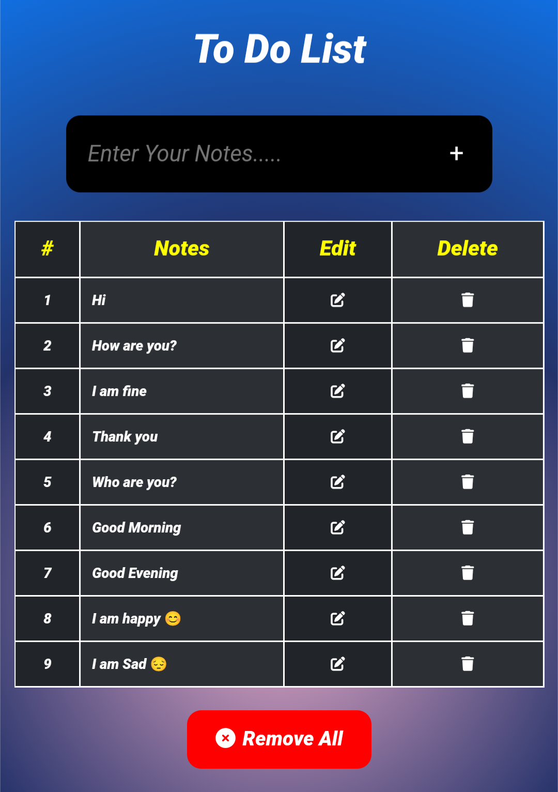

<h1 style="margin: 10px;">To Do List Web App</h1>

This is a To Do List Web App. It is created with HTML, CSS and JavaScript only.

<h3 style="margin: 10px;">Features:</h3>

<li style="margin: 10px;">Add as many notes you want.</li>
<li style="margin: 10px;">It supports local storage.</li>
<li style="margin: 10px;">It store your notes in your browser local storage.</li>
<li style="margin: 10px;">You will get your notes after page refresh as well.</li>
<li style="margin: 10px;">We have edit notes functionality.</li>
<li style="margin: 10px;">We have delete functionality.</li>
<li style="margin: 10px;">Simple & rwsponsive design.</li>
<li style="margin: 10px;">Delete All At once functionality.</li>

<h2 style="margin: 10px;">To Do List Web App</h2>

